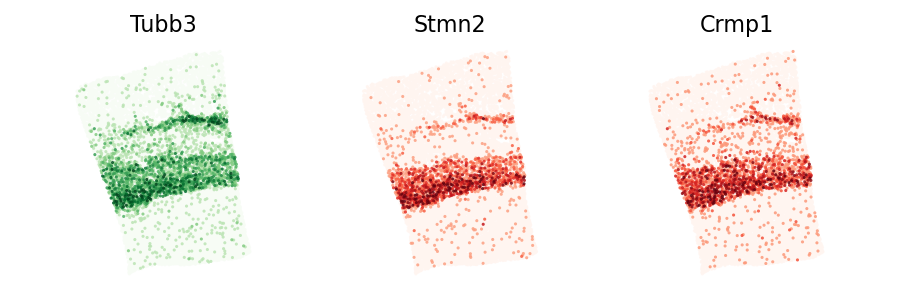
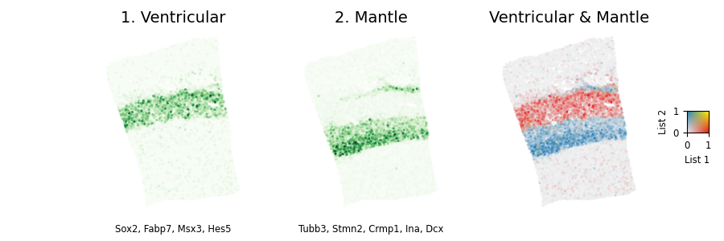
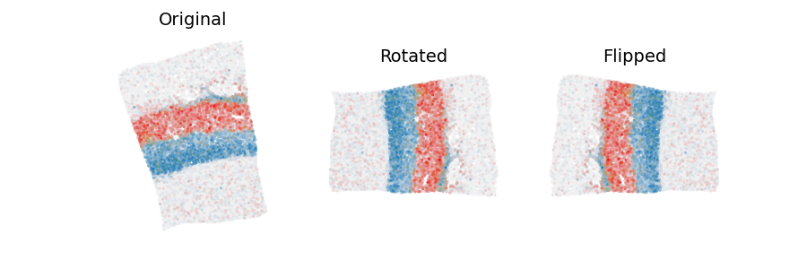
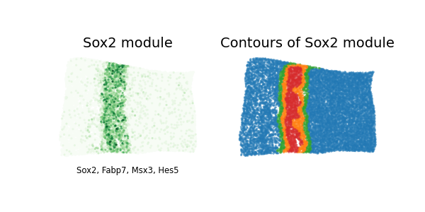

# Spatial Transcriptomics Useful Functions (STUF)
Using exising Spatial Transcriptomics (ST) analysis packages to perform simple analyses is surprisingly hard. This is because most ST tools were designed to solve complex problems. On the other hand, __STUF was designed to make conceptually simple tasks easy__. For example, using STUF and just a few lines of Python you can:

  Find genes with expression patterns similar to a gene that you specify

  ---

  <figure>
    <!--<figcaption><b>Find genes with expression patterns similar to a gene that you specify</b></figcaption>-->
  </figure>

  Show the expression of two genes or gene sets on one embedding

  ---

  <figure>
    <!--<figcaption><b>Show the expression of two genes or gene sets on one embedding</b></figcaption>-->
  </figure>

  Rotate or flip sections

  ---

  <figure>
    <!--<figcaption><b>Rotate or flip sections</b></figcaption>-->
  </figure>

  Define gradients or contours of expression

  ---

  <figure>
    <!--<figcaption><b>Define regions based on gradients of expression (i.e. contours)</b></figcaption>-->
  </figure>

